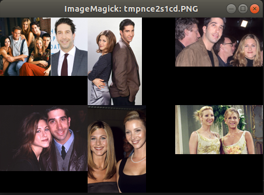
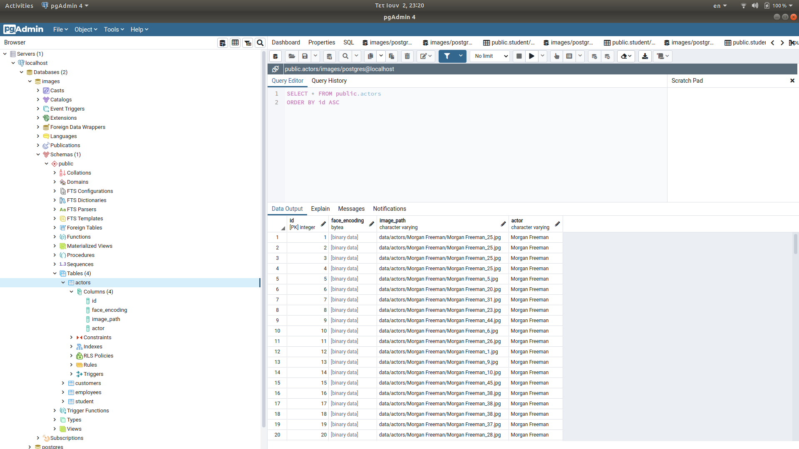
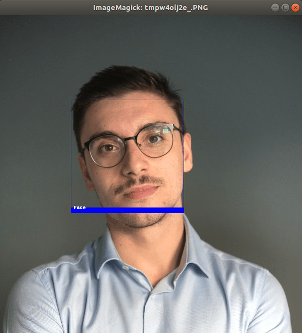

# Information Retrieval system

## Information Retrieval System, on a Multimedia Database (images) using PostgreSQL and Python.


## System Architecture


### Compenents

1. Web Scraper (Selenium: <https://selenium-python.readthedocs.io/>)

2. Face Recognition: <https://github.com/ageitgey/face_recognition>  
    The world's simplest facial recognition api for Python and the command line

3. psycopg2: <https://www.psycopg.org/>  
    PostgreSQL database adapter for the Python programming language

---
<br>

## Information Retrieval System

Return the top-k images with most similar faces, given a single image, as search query.

**Input Image:**


**Output Collage:**



Check more **input images** [here](data/query_images/) and their **topk query collages** [here](data/collages/).

<br>

---

<br>

## Project's Structure

```bash
.
├── assets
├── data
├── docs
├── LICENSE
├── notebooks
├── output
├── README.md
└── src
```

---

## Data 

```bash
├── data
│   ├── actors
│   │   ├── Alec Baldwin
│   │   ├── Al Pacino
│   │   ├── Amy Adams
│   │   ├── Angelina Jolie
│   │   ├── Anne Hathaway
...
```


---
<br>

## PostgreSQL Database and pgAdmin4



---
<br>

## Face recognistion Tasks

### 1. Face detection



### 2. Face crop


### 2. Face encoding


